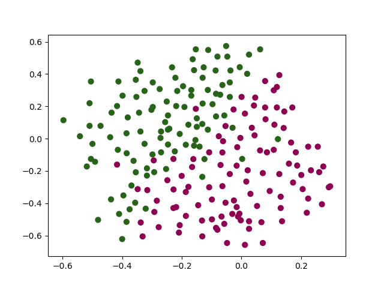
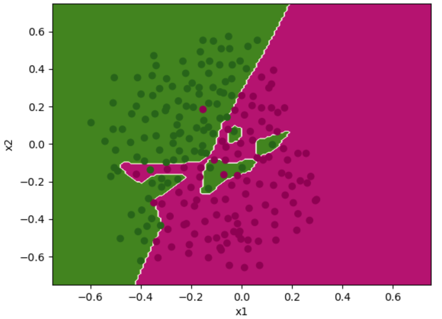
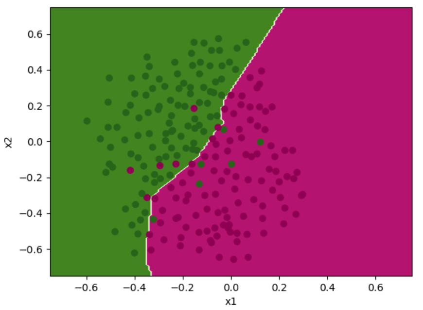

# Description

This repository represents basic framework for Neural Network model, realized using underlying mathematical concepts, therefore requires  no dependencies except `numpy` for linear algebra and `matplotlib` for visualizations.

Binary classification is made represented using Sigmoid function with cross-entropy cost:
}\log\left(a^{[L](i)}\right)%20+%20(1-y^{(i)})\log\left(1-%20a^{[L](i)}\right)))

If L2 Regularization is invoked, cost is computed as follows:
}\log\left(a^{[L](i)}\right)%20+%20(1-y^{(i)})\log\left(1-%20a^{[L](i)}\right)%20\large{)}%20}_\text{cross-entropy%20cost}%20+%20\underbrace{\frac{1}{m}%20\frac{\lambda}{2}%20\sum\limits_l\sum\limits_k\sum\limits_j%20W_{k,j}^{[l]2}%20}_\text{L2%20regularization%20cost})

# Usage Notes

To train network with your dataset:  
1. Initialize Neural Network (NN), defines architecture using `initialization.initialize_parameters_random()`
  
   *Example:*

   Initialization of Binary Classification NN with 2 hidden layers and 5 Activation Units (AU) each:  
   `parameters = initialization.initialize_parameters_random([X.shape[0], 5, 5, 1])`

2. Normalize features of Train/Dev/Test sets using `modules.featureNormalization()`
3. Call `train.train()` by feeding into Train data set (X) and it's labeled data (Y)  
  * to find correct `learning_rate`, use `print_cost=True`
  * if you supply `lambd` value to function, it will implement L2 Regularization
  * if you supply `keep_prob` value to function, it will implement DropOut Regularization

4. Tune Parameters/Hyperparameters on Dev set.
5. Analyze algorithm performance on Test set.
    - As evaluation metric F1 Score may be used.

## IN PROCESS:
- F1 Score
- Adam optimization
- DropOut Regularization
- Batch Normalization

# Optimization Notes

1. In case of Deep Networks (5+ hidden layers), consider to use `initializaiton.initialize_parameters_he()` in order to overcome Vanishing/Exploding weight problem.  

2. If Cost Function (CF) is not decreasing over epochs:
  - try to decrease `learning_rate`

3. If training process is slow (little decrease of CF over epochs, long time to iterate over epoch), then:
  - try to increase `learning_rate`
  - verify whether features are Normalized correctly
  - try to use Mini-Batch Gradient Descent (GD)
  - try to use GD optimization algorithms (momentum, RMSProp, Adam)

4. If algorithm does poorly predicting even Training set (you should compare this result with Human level error / Bayes error), then Bias reduction techniques should improve performance:
  - training more Complex Network (more AU in level, more levels)
  - longer training
  - adding more features (more information about dataset, e.g. improving quality of pictures)

5. If algorithm does well on Training set, but prediction on Dev set is poor, then Variance reduction tecnhiques should help:
  - Regularization (L2, Dropout)
  - more training data (gives better generalization)

6. If prediction on Train and Dev sets is good, but algorithm fails to predict Test set or Real world data:
  - be sure Dev and Test set come from same distribution (same data divided randomly)
  - understand whether Dev set represents Real world requiremenents well
  - analyze your evaluation metrics

# Binary Classification Example

## Dataset "binary_classification_2D"

Number of training examples: 211
Dataset visualization: 200


### Training without Regularization

NN architecture: [211, 15, 10, 1]
Learning rate = 0.5
```
Cost after iteration 29000: 0.07998743929559801
Prediction on Train set:
Accuracy: 0.971563981042654
Prediction on Dev set:
Accuracy: 0.9149999999999998
```


*Optimization Rationale:*
Assuming that dataset has ~9-11 outliers (manual analysis on visualization) out of 211 examples, Bayes error is ~5%. Therefore this prediction _overfits_ training set and has _high variance_ problem. Regularization or more training data should improve outcome with desirable result of prediction accuracy close to ~95% on _dev set_.

### Training with L2 Regularization 

NN architecture: [211, 15, 10, 1]
Learning rate = 0.5
Lambda = 0.03
```
Cost after iteration 29000: 0.23537491145509298
Accuracy: 0.9241706161137442
Accuracy: 0.9349999999999998
```



## Dataset "binary_classification_cats"

Number of training examples: 209
Number of dev examples: 50
Code: `.apply_binary_classification_cats.py`  

### Training without Regularization 

Architecture = [209, 7, 1]
learning_rate = 0.0075

```
Cost after iteration 2500: 0.033421158465249526
Prediction on Train set:
Accuracy: 0.9999999999999998
Prediction on Dev set:
Accuracy: 0.68
```

*Optimization Rationale:*
Assuming that Human and Bayes errors are close to 0%, this realization has High Variance problem. Regularization or more training data should improve results.

### Training with L2 Regularization

Improved of prediction up to 76% using L2 Regularization with lambda = 0.1 or 0.03:
```
Prediction on Dev set:

Lambda value: 0.01
Accuracy: 0.72

Lambda value: 0.03
Accuracy: 0.76

Lambda value: 0.1
Accuracy: 0.76

Lambda value: 0.3
Accuracy: 0.74
```
