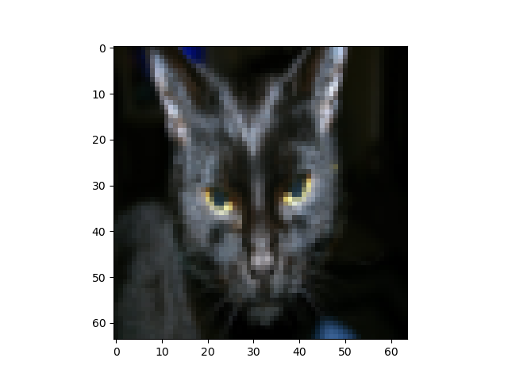

# Description

This repository contains mathematical realization of standard (fully-connected) Neural Network model, therefore requires no dependencies except `numpy` for linear algebra and `matplotlib` for visualizations.

Binary classification uses _sigmoid_ activation function with cross-entropy cost:

}\log\left(a^{[L](i)}\right)%20+%20(1-y^{(i)})\log\left(1-%20a^{[L](i)}\right)))


If _L2 regularization_ is invoked, cost is computed as follows:

}\log\left(a^{[L](i)}\right)%20+%20(1-y^{(i)})\log\left(1-%20a^{[L](i)}\right)%20\large{)}%20}_\text{cross-entropy%20cost}%20+%20\underbrace{\frac{1}{m}%20\frac{\lambda}{2}%20\sum\limits_l\sum\limits_k\sum\limits_j%20W_{k,j}^{[l]2}%20}_\text{L2%20regularization%20cost})


Activation Units (AU) in hidden layers are implemented using ReLU activation function.

# Usage Notes

To train network with your dataset:  
1. Initialize Neural Network (NN) using `modules.initialization.initialize_parameters_random()` (defines architecture of NN)
  
   *Example:*

   Initialization of Binary Classification NN with 2 hidden layers and 5 AU each:  
   `parameters = initialize_parameters_random([X.shape[0], 5, 5, 1])`

2. Normalize features of train/dev/test sets using `modules.featureNormalization.normalizeRows()`
3. Call `train.train()` by feeding into _train_ data set (X) and it's labeled data (Y)  
  * to find correct `learning_rate` use `print_cost=True`
  * if you supply `lambd` value to function, it will implement L2 Regularization
  * if you supply `keep_prob` value to function, it will implement DropOut Regularization

4. Tune NN parameters and hyperparameters on _dev_ set (see _Optimization Notes_ below).
5. Analyze algorithm performance on _test_ set.
    - As evaluation metric F1 Score may be used.

# Optimization Notes

1. In case of Deep Networks (5+ hidden layers), consider to use `initializaiton.initialize_parameters_he()` in order to overcome _vanishing/exploding weights_ problem.  

2. If Cost Function (CF) is not decreasing over epochs:
  - try to decrease `learning_rate`
  - verify if gradients in _backward propagation_ are computed correctly using `modules.gradCheck.gradient_check()`

3. If training process is slow (little decrease of CF over epochs, long time to iterate over epoch), then:
  - try to increase `learning_rate`
  - verify whether features are Normalized correctly
  - try to use Mini-Batch Gradient Descent (GD)
  - try to use GD optimization algorithms (momentum, RMSProp, Adam)

4. If algorithm does poorly predicting even Training set (you should compare this result with Human level error / Bayes error), then Bias reduction techniques should improve performance:
  - training more Complex Network (more AU in level, more levels)
  - longer training
  - adding more features (more information about dataset, e.g. improving quality of pictures)

5. If algorithm does well on Training set, but prediction on Dev set is poor, then Variance reduction tecnhiques should help:
  - regularization (L2, Dropout)
  - more training data (gives better generalization)

6. If prediction on _train_ and _dev_ sets is good, but algorithm fails to predict _test_ set or real world data:
  - be sure _dev_ and _test_ set come from same distribution (same data divided randomly)
  - increase the _dev_ set to have better generalization during NN hyperparemeter tunage
  - understand whether _dev_ and _test_ sets represent real world requiremenents well
  - analyze used evaluation metrics (choose needed out of Accuracy, F1 score, False Positives/Negatives etc.)

### IMPLEMENTATION TODO:
- Multi-class predictions (softmax activation function)
- F1 Score
- Adam optimization
- DropOut Regularization
- Batch Normalization

# Binary Classification Example

## Dataset "binary_classification_2D"

Number of training examples: 211  
Dataset visualization: 200  
Code: `.apply_binary_classification_2D.py`  


### Training without Regularization

NN architecture: [211, 15, 10, 1]  
Learning rate = 0.5  
```
Cost after iteration 29000: 0.07998743929559801
Prediction on Train set:
Accuracy: 0.971563981042654
Prediction on Dev set:
Accuracy: 0.9149999999999998
```


*Optimization Rationale:*  
Assuming that dataset has ~9-11 outliers (manual analysis on visualization) out of 211 examples, Bayes error is ~5%. Therefore this prediction _overfits_ training set (97% > 95%) and has _high variance_ problem (dev prediction 91% < 95%). Regularization or more training data should improve outcome with desirable result of prediction accuracy close to ~95% on _dev set_.

### Training with L2 Regularization 

NN architecture: [211, 15, 10, 1]  
Learning rate = 0.5  
Lambda = 0.03  
```
Cost after iteration 29000: 0.23537491145509298
Accuracy: 0.9241706161137442
Accuracy: 0.9349999999999998
```


## Dataset "binary_classification_cats"

Number of training examples: 209  
Number of dev examples: 50  
Code: `.apply_binary_classification_cats.py`  


### Training without Regularization 

Architecture = [209, 20, 7, 1]  
learning_rate = 0.0075  
```
Cost after iteration 2500: 0.033421158465249526
Prediction on Train set:
Accuracy: 0.9999999999999998
Prediction on Dev set:
Accuracy: 0.68
```

*Optimization Rationale:*  
Assuming that Human and Bayes errors are close to 0%, this realization has High Variance problem. Regularization or more training data should improve results.

### Training with L2 Regularization

Architecture = [209, 20, 7, 1]  
learning_rate = 0.05  
lambda = 0.03  
```
Cost after iteration 2900: 0.004509235155316043
Prediction on Dev set:
Accuracy: 0.78
```

# References

Code is became possible due to material taught by prof. Andrew Ng in following courses:
- https://www.coursera.org/learn/machine-learning
- https://www.coursera.org/specializations/deep-learning
